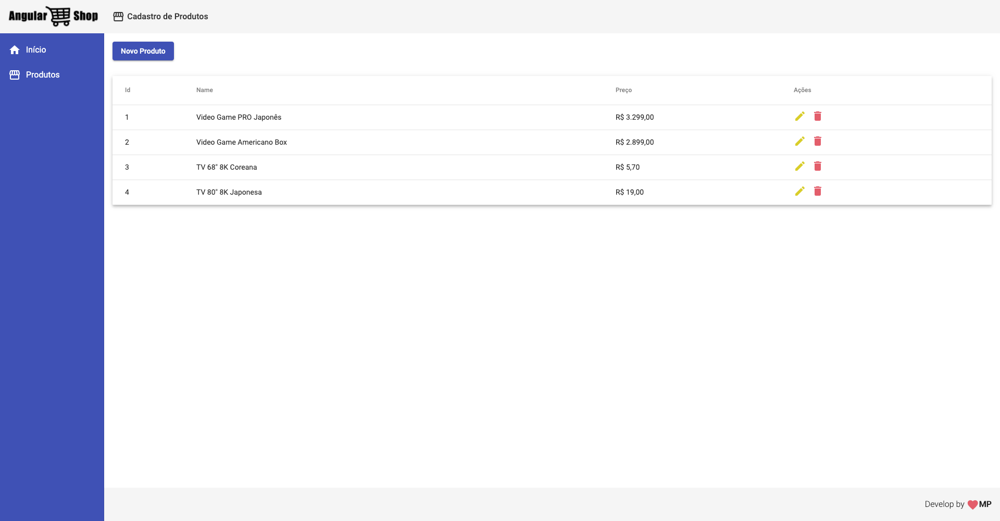
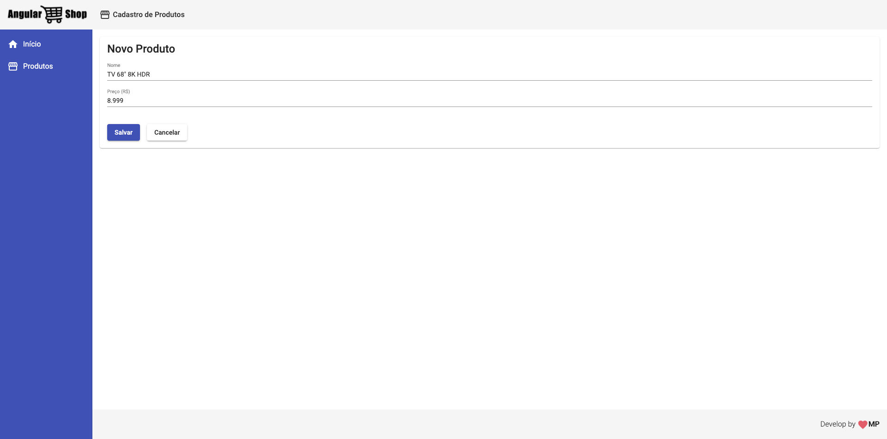
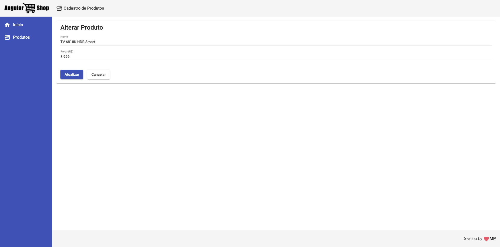
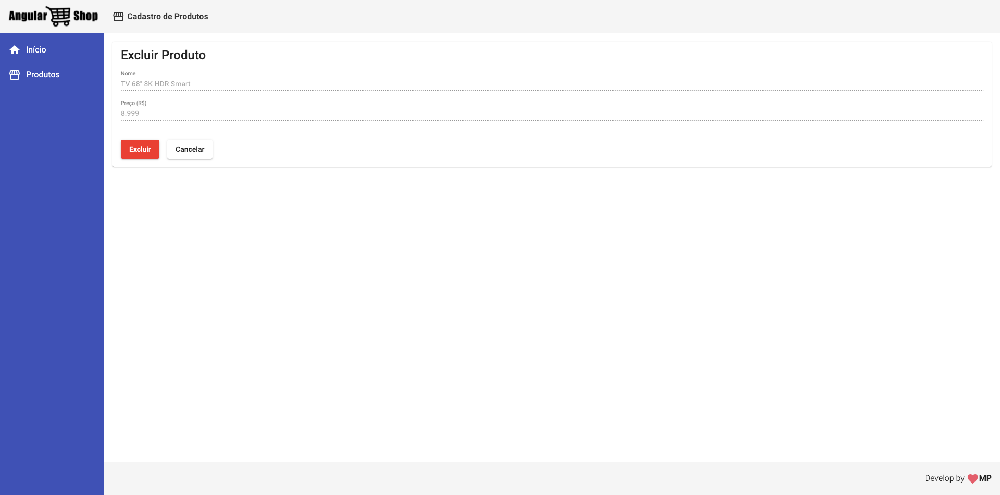

# Angular 9 Essentials - CRUD Products

<!-- PROJECT LOGO -->
 

  

## Course
- [Cod3r](https://www.cod3r.com.br/courses/angular-9-essencial)

## List Products
<h1 align="center">
   
</h1>

## Create new Product
<h1 align="center">
    
</h1>

## Update Product
<h1 align="center">
    
</h1>

## Delete Product
<h1 align="center">
    
</h1>

<!-- TABLE OF CONTENTS -->

## Content

- [Tabela de Conteúdo](#tabela-de-conte%C3%BAdo)
- [About of project](#about-the-project)
  - [Techs](#techs)
  - [Pré-requisitos](#pr%C3%A9-requisitos)
- [CONTRIBUTING](#CONTRIBUTING)
- [License](#License)
- [Contact](#contact)

<!-- ABOUT THE PROJECT -->

## ABOUT THE PROJECT

Angular 9: Simple CRUD (Material) with JSON-Server

### Techs

- [Angular](https://www.angular.io) - Angular is a platform for building mobile and desktop web applications;
- [JSON-Server](https://github.com/typicode/json-server) - Get a full fake REST API with zero coding in less than 30 seconds (seriously);

<!-- GETTING STARTED -->

### Requirements

 - Angular 9 CLI
 - NodeJS
 - JSON-Server

<!-- CONTRIBUTING -->

## CONTRIBUTING

Fique a vontade para contribuir com o projeto.

1. Faça um Fork do projeto
2. Crie uma Branch para sua Feature (`git checkout -b feature/newFeature`)
3. Adicione suas mudanças (`git add .`)
4. Comite suas mudanças (`git commit -m 'Nova funcionalidade para facilitar ...`)
5. Faça o Push da Branch (`git push origin feature/newFeature`)
6. Abra um Pull Request

-- English
- Make a fork;
- Create a branck with your feature: `git checkout -b my-feature`;
- Commit changes: `git commit -m 'feat: My new feature'`;
- Make a push to your branch: `git push origin my-feature`.

After merging your receipt request to done, you can delete a branch from yours.

## :memo: License

This project is under the MIT license. See the [LICENSE](LICENSE.md) for details.

---
## Contact
Made with ♥ by Marcus Paulo :wave: [Get in touch!](https://www.linkedin.com/in/marcuspaulo/)
